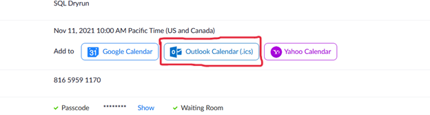
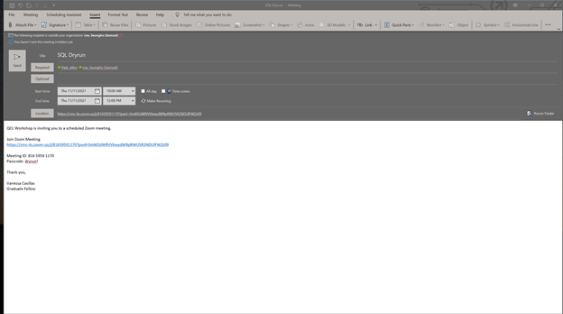

# Graduate Fellows Meeting and Bi-Weekly Meeting
* One Note Application  
    -	Titled: QCL Graduate Fellows Notebook  
    - Titled: QCL Staff Notebook
    - Titled: QCL Workshop Notebook

-	Agenda  
    -	Write meeting notes  
        - Before meeting  
    -	Follow along in the meeting  
    -	TO DOs  
        -	Your assignments for the week
```        
Template:
Date:
#Weekly one-on-one
#Workshop Schedule
#School Schedule
#Workshops
#Consulation
#Impact Report
#ETC
#Other
Workshop schedule
```
___

## How to calendar invite meetings on Zoom 

For Dryruns and Online meetings <br>

Dryruns are often done for new instructors (graduate fellows) and new workshops.<br> 
Once a date is found that works for all, we then send to zoom meeting for online meetings<br>

Click on Outlook Calendar(.ics)


Add the attendees for the Dryruns and send 



